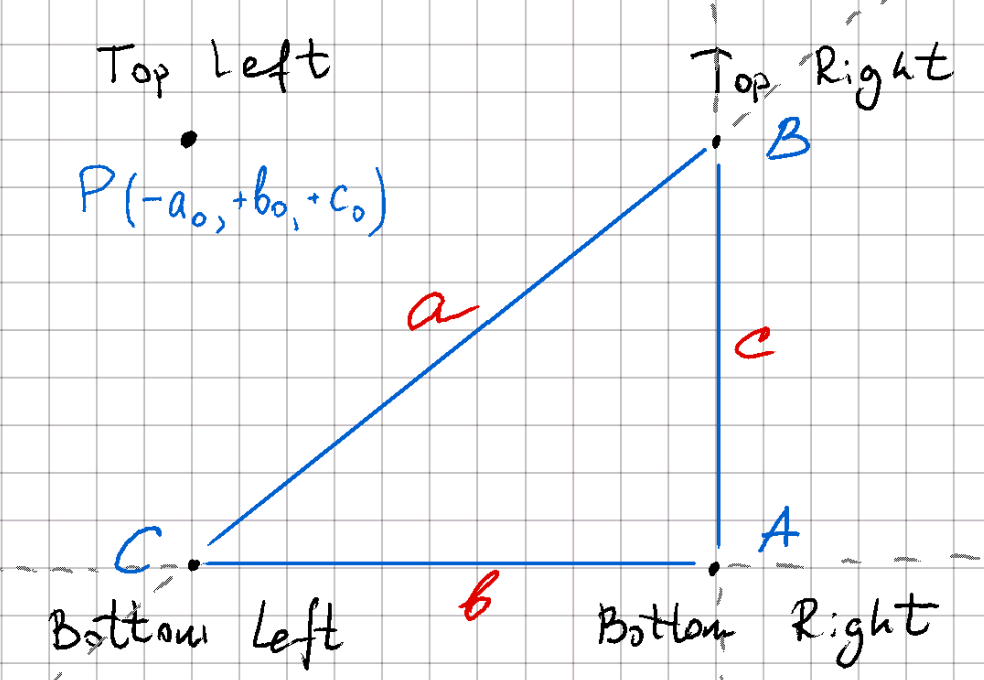

# DocLens

A simple but robust documents scanner.

| Feed                               | Documents Selector/Stitcher                                     | Corners Detection                                    | Document Preview                                             |
|------------------------------------|-----------------------------------------------------------------|------------------------------------------------------|--------------------------------------------------------------|
|  |  |  |  |


## Technologies

The application runs on **Android Lollipop and above**.

The main technologies used in the project:

- Kotlin + [Coroutines](https://kotlinlang.org/docs/coroutines-overview.html)
- [Jetpack Compose](https://developer.android.com/jetpack/compose): a robust technology to build UI
- [Open CV](https://opencv.org/): Computer Vision library

### OpenCV

Compiled OpenCV SDK can be found under [`dependencies/opencv` folder](./dependencies/opencv).

Please, do pay attention, that the compiled SDK is **patched**.
In order, to make it work smoothly with the project, the source compatibility inside [`sdk/build.gradle`](./dependencies/opencv/sdk/build.gradle).

The changes are similar to the code below:

```groovy
    compileOptions {
        sourceCompatibility JavaVersion.VERSION_17
        targetCompatibility JavaVersion.VERSION_17
    }
```

## Usage

### Basic Flow

The primary use-case consist of multiple steps:
1. Loading an image (or video) from camera or gallery
   1.2. If there are multiple images then **stitching** is happening
2. Documents automatic corners detection, and cropping
3. Editing the document (applying visual filters if necessary)
4. Saving the file to gallery

You can find below demo of all steps from this flow.

#### Loading from Gallery

| Documents Picker                                      | Documents Cropper                                           | Documents Editor                                          |
|-------------------------------------------------------|-------------------------------------------------------------|-----------------------------------------------------------|
|  |  |  |

You can find Youtube Demos below:

| Basic Flow Demo #1                                                                                                 | Basic Flow Demo #2                                                                                                 |
|--------------------------------------------------------------------------------------------------------------------|--------------------------------------------------------------------------------------------------------------------|
| [](https://www.youtube.com/watch?v=Iv4XK7NAkAg) | [](https://www.youtube.com/watch?v=54KG_SmAA2Y) |

_▶️ Youtube Demo_: if you cannot open the video from the section above, please, refer to [DocLens Youtube Playlist section](#doclens-youtube-playlist).

#### Loading from Camera

| Camera                                                                                                 |
|--------------------------------------------------------------------------------------------------------|
| [](https://www.youtube.com/watch?v=EQrTKNid59k) |

_▶️ Youtube Demo_: if you cannot open the video from the section above, please, refer to [DocLens Youtube Playlist section](#doclens-youtube-playlist).

#### Handling landscape images

| Landscape Scanning                                                                                                 |
|--------------------------------------------------------------------------------------------------------------------|
| [](https://www.youtube.com/watch?v=_X7B6LMBlEE) |

_▶️ Youtube Demo_: if you cannot open the video from the section above, please, refer to [DocLens Youtube Playlist section](#doclens-youtube-playlist).

### Scanning Video

As long as OpenCV for android does not support `mp4` containers (especially, `h264` encoding) as it missing `ffmpeg` backend,
therefore extracting video frames functionality is implemented **outside of OpenCV** and then this frames are fed into **OpenCV** for 
further analysis.

To parse the video files [Android `MediaMetadataRetriever`](https://developer.android.com/reference/android/media/MediaMetadataRetriever) is used.
There are 2 implementations of video extractors available at [`MetadataRetrieverWrapper`](./app/src/main/java/github/com/st235/documentscanner/utils/MetadataRetrieverWrapper.kt):
- **TimestampVideoFramesIterator**: works on _Androids below [Pie](https://www.android.com/versions/pie-9-0/)_ and uses [`getFrameAtTime`](https://developer.android.com/reference/android/media/MediaMetadataRetriever#getFrameAtTime()).
Works a bit slow, therefore is used only when there is no alternative.
- **IndexVideoFramesIterator**: works on _Android P and above_ and uses [`getFrameAtIndex`](https://developer.android.com/reference/android/media/MediaMetadataRetriever#getFrameAtIndex(int)). Extraction performed this way works much faster
then using `getFrameAtTime` API, therefore this algorithm is used where possible.

[`KeyFrameDetector`](./app/src/main/java/github/com/st235/documentscanner/utils/documents/KeyFrameDetector.kt) then feeds extracted frames one-by-one to [the native code](./app/src/main/cpp/github_com_st235_documentscanner_utils_documents_KeyFrameDetector.cpp),
where [`matchTemplate` from **OpenCV**](https://docs.opencv.org/3.4/df/dfb/group__imgproc__object.html#ga586ebfb0a7fb604b35a23d85391329be) is used to determine how similar two consecutive frames are.
If the similarity falls below the threshold (which was tuned empirically and is **0.95**), then it means than new **different** interval in the video has started.
At last, the longest interval is selected as an interval from where possible document would be extracted.

Check out how to scan documents that are presented on video files in the video demo below:


| Straightforward video file                                                                                                 | Video with noisy frames                                                                                                 |
|----------------------------------------------------------------------------------------------------------------------------|-------------------------------------------------------------------------------------------------------------------------|
| [](https://www.youtube.com/watch?v=oSQlyA8RAWQ) | [](https://www.youtube.com/watch?v=9pOl3OzDWY4) |

_▶️ Youtube Demo_: if you cannot open the video from the section above, please, refer to [DocLens Youtube Playlist section](#doclens-youtube-playlist).

### Image Stitching

Image stitching logic can be located in [`ImageStitcher[.h/.cpp]`](./app/src/main/cpp/processor/ImageStitcher.cpp).

The features are extracted using [SIFT](https://docs.opencv.org/3.4/da/df5/tutorial_py_sift_intro.html) and then are matched using [`FlannBasedMatcher`](https://docs.opencv.org/4.9.0/dc/de2/classcv_1_1FlannBasedMatcher.html).

| Stitching Documents                                                                                                 | Stitching Newspaper                                                                                                 |
|---------------------------------------------------------------------------------------------------------------------|---------------------------------------------------------------------------------------------------------------------|
| [](https://www.youtube.com/watch?v=sPIgiG93lWM) | [](https://www.youtube.com/watch?v=FpQYinaYS9g) |

_▶️ Youtube Demo_: if you cannot open the video from the section above, please, refer to [DocLens Youtube Playlist section](#doclens-youtube-playlist).

## Features

### Editor

The editor supports multiple operations on images:
- [Rotating 90° Clockwise](https://docs.opencv.org/4.9.0/d2/de8/group__core__array.html#ga4ad01c0978b0ce64baa246811deeac24)
- Binarisation
  - [Global thresholding](https://docs.opencv.org/4.9.0/d7/d1b/group__imgproc__misc.html#gae8a4a146d1ca78c626a53577199e9c57)
  - [Adaptive mean thresholding](https://docs.opencv.org/4.9.0/d7/d1b/group__imgproc__misc.html#ga72b913f352e4a1b1b397736707afcde3)
  - [Adaptive gaussian thresholding](https://docs.opencv.org/4.9.0/d7/d1b/group__imgproc__misc.html#ga72b913f352e4a1b1b397736707afcde3)
  - [Otsu](https://docs.opencv.org/4.9.0/d7/d1b/group__imgproc__misc.html#gaa9e58d2860d4afa658ef70a9b1115576)
  - [Triangle](https://docs.opencv.org/4.9.0/d7/d1b/group__imgproc__misc.html#gaa9e58d2860d4afa658ef70a9b1115576)
  - ⭐️ Character thresholding (this is **a custom algorithm outside of OpenCV**, please, refer to [Char threshold section](#char-threshold))
- Contrast enhancement techniques
  - Simple saturation enhancement
  - YCrCb Histogram equalization
  - [Contrast Limited Adaptive Histogram Equalization](https://docs.opencv.org/4.9.0/d6/db6/classcv_1_1CLAHE.html)
- Filtering
  - [Box filter](https://docs.opencv.org/4.9.0/d4/d86/group__imgproc__filter.html#gad533230ebf2d42509547d514f7d3fbc3)
  - [Gaussian filter](https://docs.opencv.org/4.9.0/d4/d86/group__imgproc__filter.html#gaabe8c836e97159a9193fb0b11ac52cf1)
  - [Median filter](https://docs.opencv.org/4.9.0/d4/d86/group__imgproc__filter.html#ga564869aa33e58769b4469101aac458f9)
  - [Bilateral filter](https://docs.opencv.org/4.9.0/d4/d86/group__imgproc__filter.html#ga9d7064d478c95d60003cf839430737ed)
- Denoising
  - [TVL1](https://docs.opencv.org/4.9.0/d1/d79/group__photo__denoise.html#ga7602ed5ae17b7de40152b922227c4e4f) (converts the image to grayscale)
  - [Fast Non-local Means Denoising](https://docs.opencv.org/4.9.0/d1/d79/group__photo__denoise.html#ga21abc1c8b0e15f78cd3eff672cb6c476)

The code for image processing can be found in [`ImageProcessor[.h/.cpp]`](./app/src/main/cpp/processor/ImageProcessor.cpp) or [`ImageProcess[.kt]`](./app/src/main/java/github/com/st235/documentscanner/utils/documents/ImageProcessor.kt).

Moreover, the editor supports **UNDO** to the previous state. You can see the usage example of editor usage at the video demo below:

| Editor                                                                                                 |
|--------------------------------------------------------------------------------------------------------|
| [](https://www.youtube.com/watch?v=F-SkYZSlXCA) |

_▶️ Youtube Demo_: if you cannot open the video from the section above, please, refer to [DocLens Youtube Playlist section](#doclens-youtube-playlist).

### Custom Algorithms

There are multiple algorithms implemented outside of OpenCV that helps to handle specifics of documents:
- Char Threshold
- Convex Hull Test
- Hough Circles (_⚠️ this algorithm is not used in the final project as performs less efficiently than contour detection approach, though the logic can stil be found in [`HoughDocumentScanner[.h/.cpp]`](./app/src/main/cpp/scanner/HoughDocumentScanner.cpp)_)

#### Char Threshold

Char Threshold assumes that there background of the document is usually of bright gray or white colours,
and this area corresponds to the large peak at high gray areas, while the characters from low gray areas (black)
correspond to the foreground.

```math
histogram[threshold] * 100.0 < histogram[maximum] * (100.0 - Percent)
```

The image below should give you better understanding on how the algorithm works: 

| Image                                             | Histogram                                      |
|---------------------------------------------------|------------------------------------------------|
|  |  |

You can find an implemented algorithm in [`ImageProcessor#CharThreshold`](./app/src/main/cpp/processor/ImageProcessor.cpp).

The algorithm can be applied in the `Editor/Binarisation` menu, the algorithm will be marked with a "star" sign. 

See the examples on how to find an algorithm, and the results of applying it on the documents.

| Char Threshold option in the Editor                                                | Document 1                                                  |
|------------------------------------------------------------------------------------|-------------------------------------------------------------|
|  |  |

|  Document 2                                                 | Document 3                                                  |
|-------------------------------------------------------------|-------------------------------------------------------------|
|  |  |

References:
- [char_threshold, HALCON Operator Reference](https://www.mvtec.com/doc/halcon/13/en/char_threshold.html)


#### Convex Hull Test

Convex Hull check assumes that it is impossible to take a picture of a document shape of which is not **convex**.


To check whether 4-corners shape is a convex hull:
1. Consider one of the points (**P**) (**top-left** in the project) against three others: the other points make a triangle (**ABC**).
2. Verify that triangle formed by the rest of the points is **valid** (**A** is **bottom-right** corner, **B** is **top-right** corner, and **C** is **bottom-left**): check whether **the length** of cross-product of 2 vectors forming triangle is bigger than **0**,
we don't care about the sign as it characterises how the points have been taken clockwise or counterclockwise.
3. Move this point (**P**) into the barycentric coordinates of the triangle (**ABC**) and get (A0, B0, C0) coordinates.
4.Check the point is within reasonable bounds by checking the signs of the corresponding coordinates (a < 0, b > 0, and c > 0, i.e. we are **outside** of the edge opposite to the vertex **A**, and inside the edges opposite to vertices **B** and **C**).



All the code for this test can be found inside [`CropView`](./app/src/main/java/github/com/st235/documentscanner/presentation/widgets/CropView.kt):
- checkIfBarycentricCoordinatesValid
- toBarycentric
- dot

Check out how this test works in a demo:

| Convex Hull Check                                                                                                 |
|-------------------------------------------------------------------------------------------------------------------|
| [](https://www.youtube.com/watch?v=X9YnKRJSHio) |

_▶️ Youtube Demo_: if you cannot open the video from the section above, please, refer to [DocLens Youtube Playlist section](#doclens-youtube-playlist).


## Misc

### DocLens Youtube Playlist

Playlist with all demo videos is available here: [https://www.youtube.com/playlist?list=PLucKuGqiOAE_hX1PhURkPTRjVaTCUKh3_](https://www.youtube.com/playlist?list=PLucKuGqiOAE_hX1PhURkPTRjVaTCUKh3_)

Videos from the playlist are:

- **Basic Flow Demo #1**: https://youtube.com/shorts/Iv4XK7NAkAg
- **Basic Flow Demo #2**: https://youtube.com/shorts/54KG_SmAA2Y
- **Stitching newspaper**: https://youtu.be/FpQYinaYS9g
- **Stitching document**: https://youtu.be/sPIgiG93lWM
- **Short video**: https://youtube.com/shorts/oSQlyA8RAWQ
- **Sophisticated video with noise**: https://youtu.be/9pOl3OzDWY4
- **Images from camera**: https://youtube.com/shorts/EQrTKNid59k
- **Convex hull check**: https://youtube.com/shorts/X9YnKRJSHio
- **Landscape document**: https://youtube.com/shorts/_X7B6LMBlEE
- **Editor features**: https://youtube.com/shorts/F-SkYZSlXCA

### Evaluation Criteria List

> 0-5: Loading photos from a gallery and saving the results of transformation are supported

✅ See [Basic Flow section](#basic-flow).

> 0-5: Loading videos is supported
>
> 0-9: Choice of the best video frame from a sequence of frames is supported

✅ See [Scanning Video section](#scanning-video).

> 0-5: Manual selection of four corners for geometric transformation of scanned page is supported
> 
> 0-10: Automatic selection of four corners for geometric transformation of scanned page is supported

✅ See [Basic Flow section](#basic-flow) but the functionality has been shown on **almost every** demonstration videos.

> 0-15: At least 3 different algorithms are implemented for at least one of the following operations: binarization, image filtering, noise removal, contrast enhancement

✅ See [Editor section](#editor).

> 0-5: Stitching of several photos of very-large document is implemented

✅ See [Image stitching section](#image-stitching).
 
> 0-16: Implementation of algorithms outside of OpenCV that take into account specifics of scanned documents, for example, development of the char_threshold segmentation, contrast enhancement for two-mode histogram, etc. The usage of such algorithms should be clearly stated in README

✅ See [Custom Algorithms section](#custom-algorithms).

### More document examples

| Document 1                                    | Document 2                                    | Document 3                                    |
|-----------------------------------------------|-----------------------------------------------|-----------------------------------------------|
|  |  |  |

