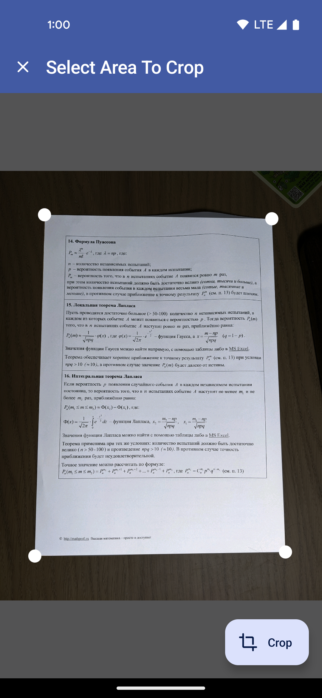

# DocLens

A simple but robust documents scanner.

| Feed                               | Corners Detection                                    | Document Preview                                     |
|------------------------------------|------------------------------------------------------|------------------------------------------------------|
|  |  |   |


## Technologies

The application runs on **Android Lollipop and above**.

The main technologies used in the project:

- Kotlin + [Coroutines](https://kotlinlang.org/docs/coroutines-overview.html)
- [Jetpack Compose](https://developer.android.com/jetpack/compose): a robust technology to build UI
- [Open CV](https://opencv.org/): Computer Vision library

### OpenCV

Compiled OpenCV SDK can be found under [`dependencies/opencv` folder](./dependencies/opencv).

Please, do pay attention, that the compiled SDK is **patched**.
In order, to make it work smoothly with the project, the source compatibility inside [`sdk/build.gradle`](./dependencies/opencv/sdk/build.gradle).

The changes are similar to the code below:

```groovy
    compileOptions {
        sourceCompatibility JavaVersion.VERSION_17
        targetCompatibility JavaVersion.VERSION_17
    }
```

## Usage

### Basic Flow

#### Gallery

| Basic Flow Demo #1                                                                                                 | Basic Flow Demo #2                                                                                                 |
|--------------------------------------------------------------------------------------------------------------------|--------------------------------------------------------------------------------------------------------------------|
| [](https://www.youtube.com/watch?v=Iv4XK7NAkAg) | [](https://www.youtube.com/watch?v=54KG_SmAA2Y) |

| Documents Picker                                      | Documents Cropper                                           | Documents Editor                                          |
|-------------------------------------------------------|-------------------------------------------------------------|-----------------------------------------------------------|
|  |  |  |

#### Camera

| Camera                                                                                                 |
|--------------------------------------------------------------------------------------------------------|
| [](https://www.youtube.com/watch?v=EQrTKNid59k) |

#### Landscape Scanning

| Landscape Scanning                                                                                                 |
|--------------------------------------------------------------------------------------------------------------------|
| [](https://www.youtube.com/watch?v=_X7B6LMBlEE) |

### Scanning Video

| Straightforward video file                                                                                                 | Video with noisy frames                                                                                                 |
|----------------------------------------------------------------------------------------------------------------------------|-------------------------------------------------------------------------------------------------------------------------|
| [](https://www.youtube.com/watch?v=oSQlyA8RAWQ) | [](https://www.youtube.com/watch?v=9pOl3OzDWY4) |

### Image Stitching

| Stitching Documents                                                                                                 | Stitching Newspaper                                                                                                 |
|---------------------------------------------------------------------------------------------------------------------|---------------------------------------------------------------------------------------------------------------------|
| [](https://www.youtube.com/watch?v=sPIgiG93lWM) | [](https://www.youtube.com/watch?v=FpQYinaYS9g) |

## Features

### Editor

| Editor                                                                                                 |
|--------------------------------------------------------------------------------------------------------|
| [](https://www.youtube.com/watch?v=F-SkYZSlXCA) |

### Custom Algorithms

There are multiple algorithms implemented that helps to handle documents

#### Char Threshold

| Char Threshold option in the Editor                                                |
|------------------------------------------------------------------------------------|
|  |


Char Threshold examples

| Document 1                                                  | Document 2                                                  | Document 3                                                  |
|-------------------------------------------------------------|-------------------------------------------------------------|-------------------------------------------------------------|
|  |  |  |

#### Convex Hull Test

| Convex Hull Check                                                                                                 |
|-------------------------------------------------------------------------------------------------------------------|
| [](https://www.youtube.com/watch?v=X9YnKRJSHio) |


## Misc

### DocLens Youtube Playlist

Plyalist with all demo videos is available here: https://www.youtube.com/playlist?list=PLucKuGqiOAE_hX1PhURkPTRjVaTCUKh3_

Videos from the playlist are:

- **Basic Flow Demo #1**: https://youtube.com/shorts/Iv4XK7NAkAg
- **Basic Flow Demo #2**: https://youtube.com/shorts/54KG_SmAA2Y
- **Stitching newspaper**: https://youtu.be/FpQYinaYS9g
- **Stitching document**: https://youtu.be/sPIgiG93lWM
- **Short video**: https://youtube.com/shorts/oSQlyA8RAWQ
- **Sophisticated video with noise**: https://youtu.be/9pOl3OzDWY4
- **Images from camera**: https://youtube.com/shorts/EQrTKNid59k
- **Convex hull check**: https://youtube.com/shorts/X9YnKRJSHio
- **Landscape document**: https://youtube.com/shorts/_X7B6LMBlEE
- **Editor features**: https://youtube.com/shorts/F-SkYZSlXCA

### Evaluation Criteria List

> 0-5: Loading photos from a gallery and saving the results of transformation are supported


0-5: Loading videos is supported

0-9: Choice of the best video frame from a sequence of frames is supported

0-5: Manual selection of four corners for geometric transformation of scanned page is supported

0-10: Automatic selection of four corners for geometric transformation of scanned page is supported

0-15: At least 3 different algorithms are implemented for at least one of the following operations: binarization, image filtering, noise removal, contrast enhancement

0-5: Stitching of several photos of very-large document is implemented

0-16: Implementation of algorithms outside of OpenCV that take into account specifics of scanned documents, for example, development of the char_threshold segmentation, contrast enhancement for two-mode histogram, etc. The usage of such algorithms should be clearly stated in README

### More document examples

| Document 1                                    | Document 2                                    | Document 3                                    |
|-----------------------------------------------|-----------------------------------------------|-----------------------------------------------|
|  |  |  |

